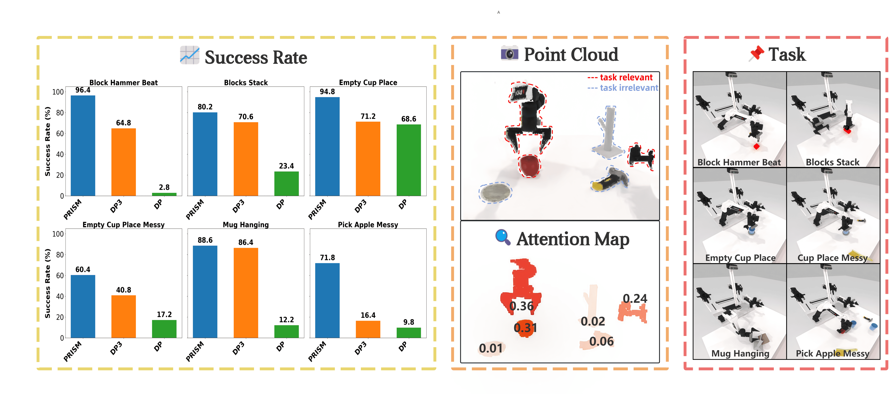
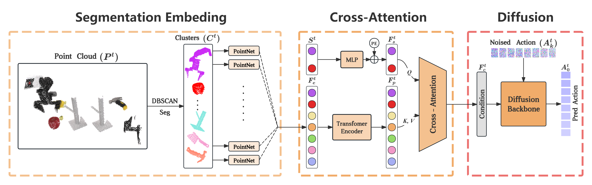
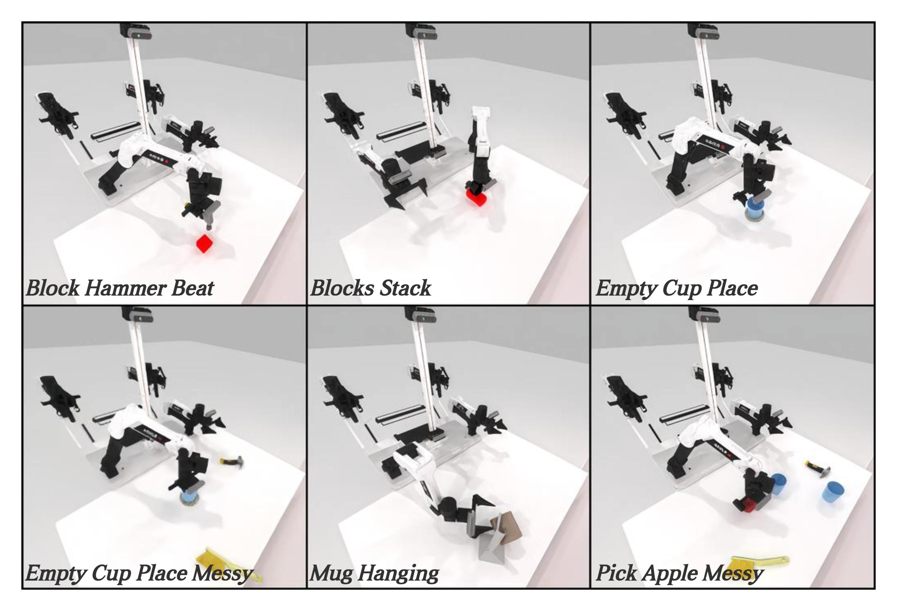
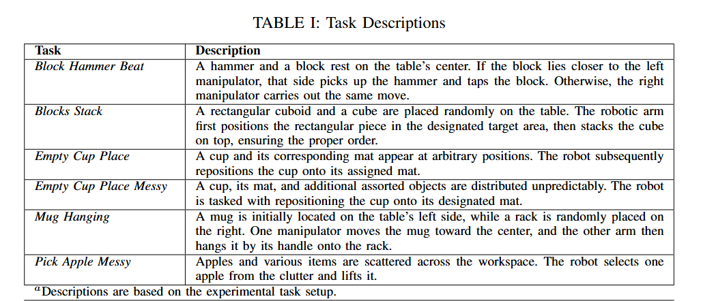

<h1 align="center">
    PRISM: Pointcloud Reintegrated Inference via Segmentation and Cross-attention for Manipulation<br>
</h1>

<br>Daqi Huang<sup>* </sup>, Zhehao Cai<sup>* </sup>, Yuzhi Hao, Zechen Li, Chee-Meng Chew<sup>†</sup>

Accepted by IEEE RA-L(Robotics and Automation Letters)

[PDF](https://ieeexplore.ieee.org/document/11150701) | [arxiv](http://arxiv.org/abs/2507.04633)<br>
# 🚀 PRISM

## 🖼️ Demo
|  |  |
| --- | --- |
|  |  |

## 🧩 Policy

## 🎯 Task
<p align="center">
   
</p>


# ⚙️ Getting Started

## 📦 Installation
> Please note that you need to strictly follow the steps: **Modify `mplib` Library Code** and **Download Assert**.
See [INSTALLATION.md](./INSTALLATION.md) for installation instructions.

## ▶️ Usage 
### 1. Task Running and Data Collection
Running the following command will first search for a random seed for the target collection quantity (default is 100), and then replay the seed to collect data.
```
bash run_task.sh ${task_name} ${gpu_id}
```
### 2. Training PRISM
Then, move to `policy/PRISM-Policy` first, and run the following code to train PRISM:
```
bash train.sh ${task_name} ${head_camera_type} ${expert_data_num} ${seed} ${gpu_id}
# As example: bash train.sh block_hammer_beat L515 100 0 0
```
### 3. Evaluating PRISM
Move to `policy/PRISM-Policy` first, run the following code to evaluate PRISM for a specific task:
```
bash eval.sh ${task_name} ${head_camera_type} ${expert_data_num} ${checkpoint_num} ${seed} ${gpu_id}
# As example: bash eval.sh block_hammer_beat L515 100 3000 0 0
```
# 🔖 Citation
```
@ARTICLE{11150701,
  author={Huang, Daqi and Cai, Zhehao and Hao, Yuzhi and Li, Zechen and Chew, Chee-Meng},
  journal={IEEE Robotics and Automation Letters}, 
  title={PRISM: Pointcloud Reintegrated Inference via Segmentation and Cross-attention for Manipulation}, 
  year={2025},
  volume={},
  number={},
  pages={1-8},
  keywords={Robots;Point cloud compression;Three-dimensional displays;Feature extraction;Imitation learning;Visualization;Noise;Training;Manuals;Data models;Imitation Learning;Perception for Manipulation;Point Cloud Segmentation;Sensor Fusion;Diffusion Model},
  doi={10.1109/LRA.2025.3606379}}
```

# 🙏 Acknowledgements
- Our diffusion module, Pointnet module is adapted from Diffusion Policy. This part is under MIT License.
- Our cross attention module is adapted from RDT.
- Our simulation environment is adapted from [RoboTwin](https://github.com/TianxingChen/RoboTwin).

# 🏷 License
This repository is released under the MIT license. See [LICENSE](./LICENSE.txt) for additional details.

