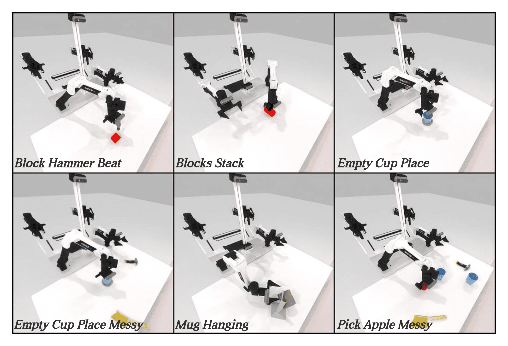

<h1 align="center">
	PRISM: Pointcloud Reintegrated Inference via Segmentation and Cross-attention for Manipulation<br>
</h1>

# 📚 PRISM


|  |  |
| --- | --- |
|  |  |

## 🛠️ Policy

## 🧑🏻‍💻 Task
<p align="center">
   
</p>


## 🧑🏻‍💻 Result


# 📚 Getting Started

## 🛠️ Installation
> Please note that you need to strictly follow the steps: **Modify `mplib` Library Code** and **Download Assert**.
See [INSTALLATION.md](./INSTALLATION.md) for installation instructions.

## 🧑🏻‍💻 Usage 
### 1. Task Running and Data Collection
Running the following command will first search for a random seed for the target collection quantity (default is 100), and then replay the seed to collect data.
```
bash run_task.sh ${task_name} ${gpu_id}
```
### 2. Training PRISM
Then, move to `policy/PRISM-Policy` first, and run the following code to train PRISM:
```
bash train.sh ${task_name} ${head_camera_type} ${expert_data_num} ${seed} ${gpu_id}
# As example: bash train.sh block_hammer_beat L515 100 0 0
```
### 3. Evaluating PRISM
Move to `policy/PRISM-Policy` first, run the following code to evaluate PRISM for a specific task:
```
bash eval.sh ${task_name} ${head_camera_type} ${expert_data_num} ${checkpoint_num} ${seed} ${gpu_id}
# As example: bash eval.sh block_hammer_beat L515 100 3000 0 0
```
# Reference
<a id="RoboTwin"></a>
[1] Y. Mu, T. Chen, S. Peng, Z. Chen, Z. Gao, Y. Zou, L. Lin, Z. Xie, and P. Luo,  
"RoboTwin: Dual-Arm Robot Benchmark with Generative Digital Twins (early version),"  
arXiv preprint [arXiv:2409.02920](https://arxiv.org/abs/2409.02920), 2024. [github](https://github.com/TianxingChen/RoboTwin)


# Acknowledge
- Our diffusion module is adapted from Diffusion Policy. This part is under MIT License.
- Our transformer module is adapted from ACT, which used DETR in their implementations. The DETR part is under APACHE 2.0 License.
- Our Minkowski ResNet observation encoder is adapted from the examples of the MinkowskiEngine repository. This part is under MIT License.
- Our temporal ensemble implementation is inspired by the recent HATO project.

